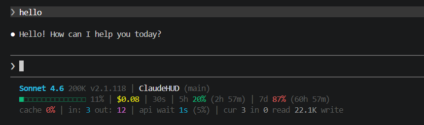

# ClaudeHUD

A Windows-native status line for [Claude Code](https://claude.ai/code) — inspired by [this YouTube video](https://youtu.be/KuZ6toRchKc?si=jCfnucxpob0Bdx8J) which only covered Mac/Linux. This project ports the same rich HUD to Windows using PowerShell.

## Preview



## What it shows

Three lines of live session info rendered in your terminal:

**Line 1** — Model name · context window size · version · repo (with clickable hyperlink in Windows Terminal) · git branch · lines added/removed · git file stats (M/A/D) · active agent · Vim mode

**Line 2** — Context bar (■■■□□ 42%) · session cost · total duration · 5h rate limit % + reset countdown · 7d rate limit % + reset countdown

**Line 3** — Cache hit rate · total tokens in/out · API wait time (% of total) · current turn token detail (input / cache read / cache write)

Colors shift green → yellow → red as percentages climb.

## Requirements

- Windows 10 / 11 with [Windows Terminal](https://aka.ms/terminal) (recommended for ANSI color and hyperlink support)
- PowerShell 5.1+ (built into Windows)
- [Claude Code CLI](https://claude.ai/code)
- Git (optional — needed for branch/file stats)

## Setup

1. Clone or download this repo.

2. In your Claude Code settings, point the status line command at the PowerShell script:

   ```json
   {
     "statusCommand": "powershell.exe -File C:\\path\\to\\ClaudeHUD\\statusline.ps1"
   }
   ```

   Adjust the path to wherever you saved the repo.

3. Start a Claude Code session — the HUD appears automatically at the bottom of each response.

## Files

| File | Description |
|------|-------------|
| `statusline.ps1` | Windows PowerShell status line (main file) |
| `statusline.sh` | Original Bash version (Mac/Linux reference) |

## How it works

Claude Code pipes a JSON blob to the status line command after each response. The script parses that JSON with PowerShell's native `ConvertFrom-Json` (no `jq` required), builds ANSI-colored output, and writes three lines to stdout. Windows Terminal renders the colors and OSC 8 hyperlinks natively.

Key Windows adaptations over the original shell script:

- `ConvertFrom-Json` replaces `jq`
- PowerShell math operators replace `bc` / `cut`
- Backslash escaping in Windows paths is handled before JSON parsing
- Progress bar uses `■`/`□` (U+25A0/U+25A1) instead of `●` for better font compatibility
- Clickable repo links use OSC 8 escape sequences supported by Windows Terminal

## Inspiration

Based on the statusline concept from [this video](https://youtu.be/KuZ6toRchKc?si=jCfnucxpob0Bdx8J). The original script targets Mac/Linux (Bash + jq). This repo makes the same experience available on Windows without WSL or additional dependencies.
